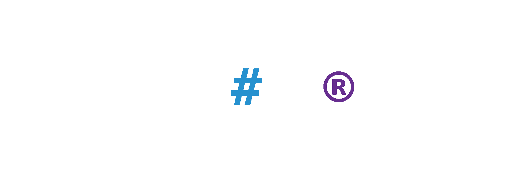

#  collabor**8**

**Collabor8** is an innovative, web-based collaborative code editor designed for developers to work together seamlessly in real-time. Built on modern, scalable technologies like **React**, **NestJS**, **Socket.io**, and **Yjs**, Collabor8 redefines collaborative coding by offering a powerful environment for real-time code sharing, editing, and communication. Whether you’re coding solo or in a team, Collabor8 brings synchronized coding experiences directly to your browser, fueling creativity and enhancing productivity.


## 🚀 Key Features

- **Real-time Collaboration**: Collaborate live with multiple users. Track changes instantly, see others’ cursors, and work together on the same codebase in real time.
- **Code Synchronization**: With `Yjs` shared objects and WebSocket integration, code syncing happens effortlessly across all active sessions.
- **Syntax Highlighting & Formatting**: Experience a developer-friendly interface with multi-language support, advanced syntax highlighting, and integrated code formatting using `CodeMirror`.
- **Built-in Voice Chat**: Seamless communication with your team using integrated voice chat powered by `Agora`, enabling real-time discussions.
- **User Awareness**: Track who is online, their activities, and view their live cursors and file updates for maximum team awareness.
- **Project Invitations**: Invite collaborators via email or username, directly from the app, making team collaboration smoother than ever.
- **Responsive Design**: A clean, intuitive, and fully responsive UI designed with **Chakra UI** and **Tailwind CSS**, ensuring usability across devices, from mobile to desktop.


---

## 📂 Table of Contents

1. [About Collabor8](#about-collabor8)
2. [Technologies Used](#technologies-used)
3. [Live Application & API Documentation](#-live-application--api-documentation)
4. [Getting Started](#getting-started)
   - [Prerequisites](#prerequisites)
   - [Installation](#installation)
   - [Running the Project](#running-the-project)
5. [Project Architecture](#project-architecture)
6. [Contributing](#contributing)
7. [License](#license)
8. [Contact Us](#contact-us)
9. [Team](#team)

---

## About Collabor8

At its core, **Collabor8** is about transforming how developers collaborate. Whether it's for pair programming, conducting a code review, or working on complex team projects, Collabor8 provides a fast, fluid, and scalable environment. The platform’s backbone is built with `Socket.io` and `Yjs`, delivering real-time, conflict-free shared editing experiences. Collabor8 also supports multiple programming languages with syntax highlighting and voice-enabled teamwork, allowing developers to communicate seamlessly while coding.

---

## Technologies Used

We leverage the best technologies to ensure scalability, performance, and a top-tier developer experience:

- **Frontend:**
  - [ReactJS](https://reactjs.org/) - A highly efficient, declarative UI library for building the interactive components.
  - [Vite](https://vitejs.dev/) - Lightning-fast development server with optimized build processes.
  - [CodeMirror](https://codemirror.net/) - An adaptable code editor that supports multiple languages and custom configurations.
  - [Chakra UI](https://chakra-ui.com/) + [Tailwind CSS](https://tailwindcss.com/) - Modern styling libraries for building responsive and clean user interfaces.
  - [Redux + RTK](https://redux-toolkit.js.org/) - State management for complex application flows.

- **Backend:**
  - [NestJS](https://nestjs.com/) - A powerful framework for building efficient, reliable, and scalable server-side applications.
  - [MySQL](https://www.mysql.com/) - For handling relational data, ensuring fast, structured queries.
  - [MongoDB](https://www.mongodb.com/) - NoSQL database to store project files and real-time data.
  - [Redis](https://redis.io/) - Used for caching and ensuring performance optimization.
  - [JWT & Passport](https://jwt.io/) - Secure user authentication and authorization.

- **Real-time Communication:**
  - [Socket.io](https://socket.io/) - Provides the backbone for real-time communication between users.
  - [Yjs](https://yjs.dev/) - Ensures conflict-free, real-time collaborative editing.
  - [Agora](https://www.agora.io/) - Facilitates voice communication for smooth, in-app discussions.

- **DevOps & Miscellaneous:**
  - [Docker](https://www.docker.com/) - Containerization for rapid deployment and environment consistency.
  - [BullMQ](https://docs.bullmq.io/) - Manages job queues for background tasks.
  - [Mailer](https://nodemailer.com/) - Enables automated email communications.
  - [Swagger](https://swagger.io/) - Documentation and API testing for easy developer access.

---

## 🌍 Live Application & API Documentation

Explore **Collabor8** in action and experience real-time collaboration at its finest. 

- **App Link:** [Collabor8 Web App](https://co11abor8.netlify.app)  
- **API Documentation:** [Collabor8 API Docs](https://collabor8.eduresource.tech/api-docs)

---

## Getting Started

### Prerequisites

To set up Collabor8, ensure you have the following installed:

- **Node.js** (v14+)
- **npm** or **yarn**
- **Docker** (for containerized deployments)
- **tmux** (optional, for session management)

### Installation

Clone the repository and navigate into the project directory:

```bash
git clone https://github.com/reunicorn1/collabor8.git
cd collabor8
```

Install dependencies:

```bash
make setup
```

### Running the Project

Start both the frontend and backend in separate `tmux` sessions for efficient multitasking:

```bash
make run
```

To run services individually:

- **Frontend**: `make run_react`
- **Backend**: `make run_nest`
- **WebSocket**: `make run_socket`

---

## Project Architecture

Collabor8's architecture is carefully designed to offer modularity and scalability:

1. **Frontend**: Built using **React**, with `CodeMirror` as the core code editor and `Yjs` for real-time collaboration.
2. **Backend**: Powered by **NestJS**, this layer handles API requests, user authentication, and project management.
3. **WebSocket Server**: Managed by `Hocuspocus`, this server handles the real-time code syncing, file structure synchronization, and online presence updates.

---

## Contributing

We’re always excited to collaborate with developers passionate about creating tools that matter. To contribute:

1. Fork the repository.
2. Create a new branch for your feature or fix.
3. Write clean, modular, and tested code.
4. Submit a PR with a detailed explanation of your changes.


---

## License

This project is licensed under the MIT License. Please refer to the [LICENSE](LICENSE) file for full terms.

---

## Contact Us

Need help or have suggestions? Reach out to us via:

- GitHub: [Collabor8 Repository](https://github.com/reunicorn1/collabor8)

---

## Team

Collabor8 is brought to life by a talented, passionate, and skilled engineering team:

- [**Mohamed Elfadil Ali**](https://www.linkedin.com/in/mohamedelfadil/)
- [**Abdallah Abdelrahman**](https://www.linkedin.com/in/abdallah-alkaser/)
- [**Mohannad Babeker**](https://www.linkedin.com/in/mohannad-abdul-aziz-babeker/)
- [**Reem Osama**](https://www.linkedin.com/in/reosama/)

Our team is dedicated to continuous innovation, striving to make Collabor8 the go-to platform for seamless, real-time coding collaboration. We take pride in crafting tools that empower developers to build the future, together.


